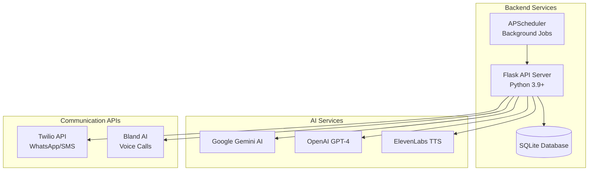
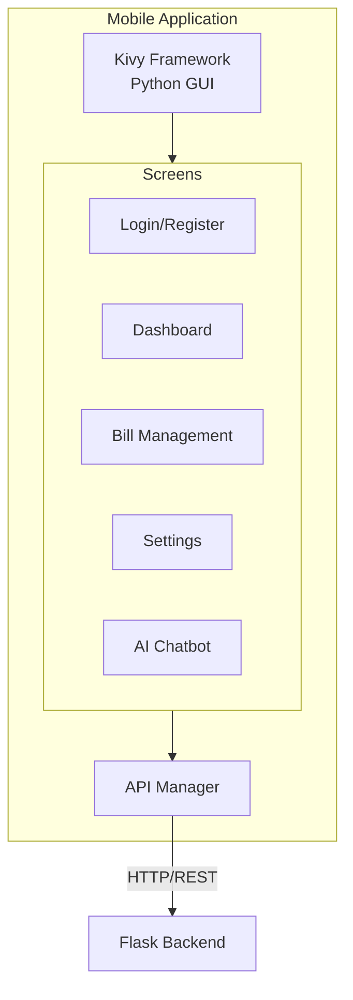
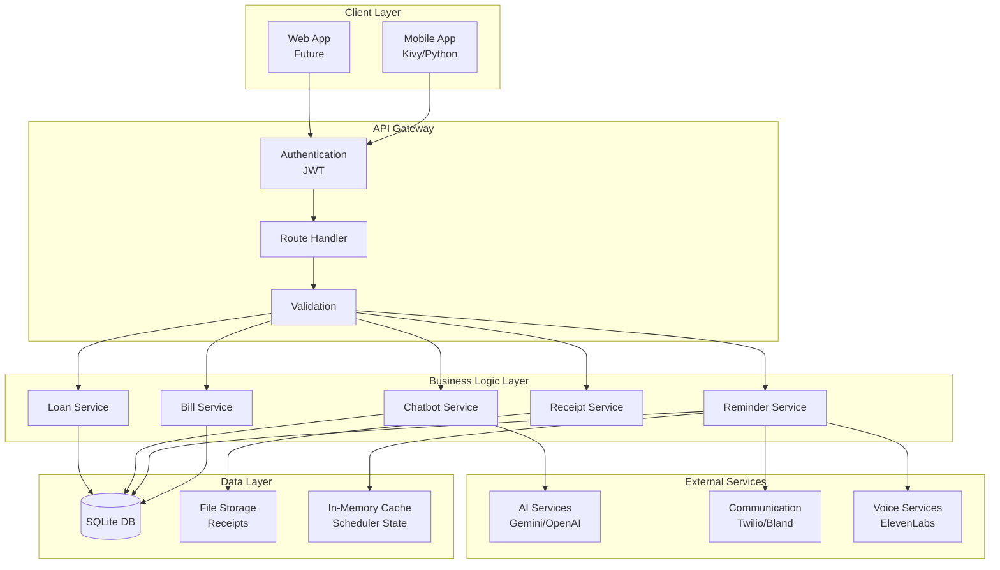
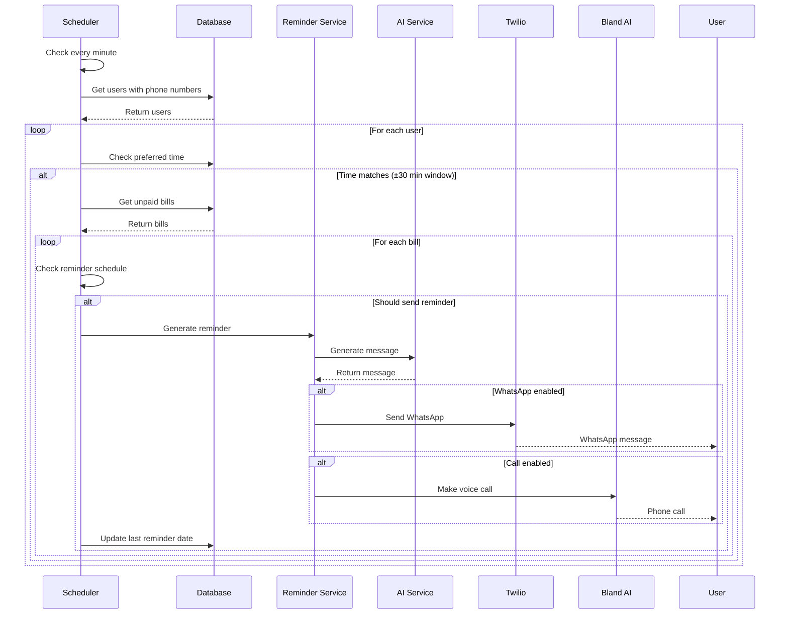
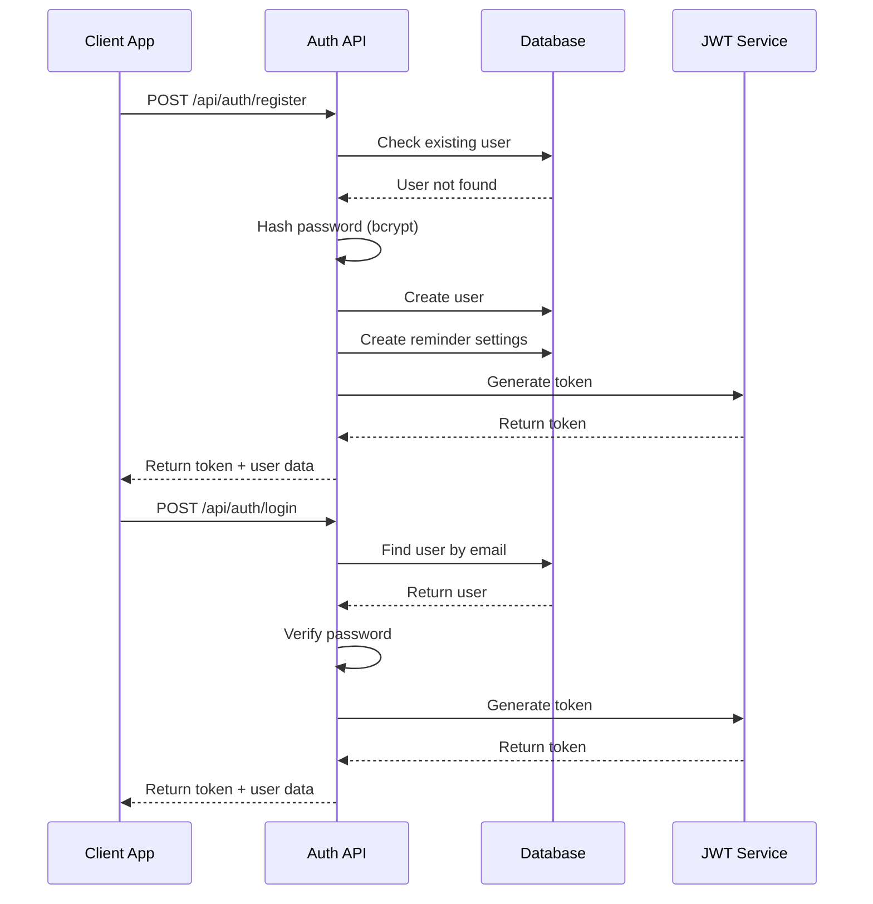
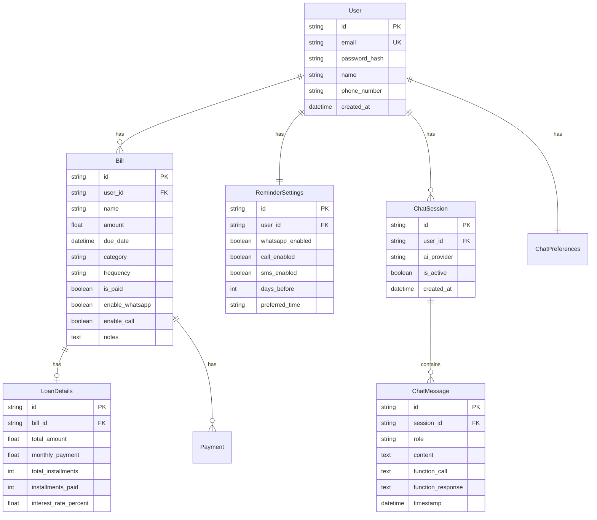

# 💰 Smart Bills Reminder System

<div align="center">
  


**An intelligent bill management system with AI-powered reminders via WhatsApp, Voice Calls, and SMS**

[Features](#-features) • [Tech Stack](#-tech-stack) • [Architecture](#-architecture) • [Installation](#-installation) • [API Documentation](#-api-documentation) • [Contributing](#-contributing)

</div>

---

## 🌟 Features

### Core Functionality
- 📱 **Cross-Platform Mobile App** - Native Android/iOS support via Kivy
- 💳 **Bill Management** - Create, update, delete, and track bills
- 🔄 **Recurring Bills** - Automatic generation for weekly/monthly/quarterly/yearly bills
- 💸 **Loan/EMI Tracking** - Specialized tracking for loans with installment management
- 📸 **Receipt Management** - Upload and store bill receipts
- 🤖 **AI Chatbot Assistant** - Natural language interaction for bill queries

### Reminder System
- 📲 **WhatsApp Notifications** - Automated reminders via Twilio WhatsApp Business API
- 📞 **Voice Call Reminders** - AI-powered voice calls using Bland AI
- 💬 **SMS Alerts** - Text message reminders for critical bills
- ⏰ **Smart Scheduling** - Customizable reminder times and frequencies
- 🔴 **Overdue Alerts** - Special handling for overdue payments

### AI Integration
- 🧠 **Google Gemini AI** - Natural language processing for chatbot
- 🎯 **OpenAI GPT-4** - Alternative AI provider for enhanced responses
- 🗣️ **ElevenLabs Voice** - Text-to-speech for voice reminders
- 📊 **Intelligent Insights** - AI-powered spending analysis and recommendations

---

## 🛠 Tech Stack

### Backend Architecture



### Frontend Architecture



### Detailed Tech Components

#### **Backend Technologies**
| Technology | Version | Purpose |
|------------|---------|---------|
| Python | 3.9+ | Core programming language |
| Flask | 2.0+ | Web framework for REST API |
| SQLAlchemy | 1.4+ | ORM for database management |
| Flask-JWT-Extended | 4.0+ | JWT authentication |
| APScheduler | 3.10+ | Background job scheduling |
| Bcrypt | 4.0+ | Password hashing |
| Cryptography | 41.0+ | API key encryption |

#### **AI & ML Services**
| Service | Purpose | Features |
|---------|---------|----------|
| Google Gemini | Primary AI chatbot | Natural language understanding, Context awareness |
| OpenAI GPT-4 | Alternative AI provider | Advanced reasoning, Code generation |
| ElevenLabs | Voice synthesis | Natural-sounding voice reminders |

#### **Communication Services**
| Service | Purpose | Configuration |
|---------|---------|---------------|
| Twilio WhatsApp | WhatsApp messaging | Business API integration |
| Twilio SMS | Text messaging | Fallback for WhatsApp |
| Bland AI | Voice calls | AI-powered phone calls |

#### **Frontend Technologies**
| Technology | Version | Purpose |
|------------|---------|---------|
| Kivy | 2.0+ | Cross-platform GUI framework |
| KivyMD | 1.0+ | Material Design components |
| Python-for-Android | - | Android APK building |
| Buildozer | 1.4+ | Mobile app packaging |

---

## 🏗 System Architecture

### High-Level Architecture Flow



### Reminder System Flow



### Authentication Flow



---

## 📁 Project Structure

```
bills-reminder-app/
├── backend/
│   ├── app.py                 # Flask application entry point
│   ├── config.py              # Configuration settings
│   ├── models.py              # SQLAlchemy database models
│   ├── auth.py                # Authentication endpoints
│   ├── bills.py               # Bill management endpoints
│   ├── loans.py               # Loan/EMI management
│   ├── receipts.py            # Receipt handling
│   ├── reminders.py           # Reminder configuration
│   ├── chatbot.py             # AI chatbot endpoints
│   ├── chatbot_models.py      # Chatbot database models
│   ├── ai_service.py          # AI service integration
│   ├── reminder_service.py    # WhatsApp/Call/SMS services
│   ├── scheduler.py           # APScheduler configuration
│   ├── elevenlabs_service.py  # Voice synthesis
│   └── local_storage_service.py # File storage handling
│
├── frontend/
│   ├── main.py                # Kivy application entry
│   ├── chatbot_screen.py      # Chatbot UI implementation
│   ├── styles.kv              # Global styling
│   ├── auth_screens.kv        # Login/Register UI
│   ├── dashboard_screen.kv    # Main dashboard UI
│   ├── add_bill_screen.kv     # Bill creation UI
│   ├── settings_screen.kv     # Settings UI
│   └── chatbot_screen.kv      # Chatbot UI
│
├── instance/
│   └── bills_reminder.db      # SQLite database
│
├── uploads/
│   └── receipts/              # Receipt storage
│
├── requirements.txt           # Python dependencies
├── .env.example              # Environment variables template
└── README.md                 # Documentation
```

---

## 🚀 Installation

### Prerequisites
- Python 3.9 or higher
- Git
- Virtual environment tool (venv/virtualenv)
- Android SDK (for mobile deployment)

### Backend Setup

```bash
# Clone the repository
git clone https://github.com/yourusername/bills-reminder-app.git
cd bills-reminder-app

# Create virtual environment
python -m venv venv

# Activate virtual environment
# On Windows:
venv\Scripts\activate
# On macOS/Linux:
source venv/bin/activate

# Install dependencies
pip install -r requirements.txt

# Create .env file from template
cp .env.example .env

# Configure environment variables in .env:
# - Add Twilio credentials
# - Add Google Gemini API key
# - Add Bland AI API key
# - Add ElevenLabs API key
# - Set JWT secret key
# - Set encryption key

# Initialize database
python app.py

# The server will start on http://localhost:5000
```

### Frontend Setup

```bash
# Navigate to frontend directory
cd frontend

# Install Kivy dependencies
pip install kivy kivymd

# Run the application
python main.py

# For Android deployment:
pip install buildozer
buildozer init
buildozer android debug
```

### Environment Variables

Create a `.env` file with the following variables:

```env
# Flask Configuration
SECRET_KEY=your-secret-key-here
JWT_SECRET_KEY=your-jwt-secret-key

# Database
DATABASE_URL=sqlite:///bills_reminder.db

# Twilio Configuration
TWILIO_ACCOUNT_SID=your-twilio-account-sid
TWILIO_AUTH_TOKEN=your-twilio-auth-token
TWILIO_WHATSAPP_FROM=whatsapp:+14155238886

# AI Services
GOOGLE_API_KEY=your-gemini-api-key
OPENAI_API_KEY=your-openai-api-key
BLAND_AI_API_KEY=your-bland-ai-key
ELEVENLABS_API_KEY=your-elevenlabs-key

# Encryption
ENCRYPTION_KEY=your-fernet-encryption-key
```

---

## 📡 API Documentation

### Authentication Endpoints

| Method | Endpoint | Description | Request Body |
|--------|----------|-------------|--------------|
| POST | `/api/auth/register` | Register new user | `{email, password, name, phone_number}` |
| POST | `/api/auth/login` | User login | `{email, password}` |
| GET | `/api/auth/profile` | Get user profile | - |
| PUT | `/api/auth/profile` | Update profile | `{name, phone_number}` |
| POST | `/api/auth/logout` | Logout user | - |

### Bill Management Endpoints

| Method | Endpoint | Description | Request Body |
|--------|----------|-------------|--------------|
| GET | `/api/bills` | Get all bills | - |
| POST | `/api/bills` | Create new bill | `{name, amount, due_date, category, frequency}` |
| PUT | `/api/bills/{id}` | Update bill | `{name, amount, due_date, etc.}` |
| DELETE | `/api/bills/{id}` | Delete bill | - |
| POST | `/api/bills/{id}/pay` | Mark as paid | - |

### Reminder Endpoints

| Method | Endpoint | Description | Request Body |
|--------|----------|-------------|--------------|
| GET | `/api/reminders/settings` | Get settings | - |
| PUT | `/api/reminders/settings` | Update settings | `{whatsapp_enabled, call_enabled, etc.}` |
| POST | `/api/reminders/test` | Send test reminder | `{type: 'whatsapp'/'call'}` |

### Chatbot Endpoints

| Method | Endpoint | Description | Request Body |
|--------|----------|-------------|--------------|
| POST | `/api/chat/session` | Create session | `{ai_provider}` |
| POST | `/api/chat/message` | Send message | `{session_id, message}` |
| GET | `/api/chat/history/{id}` | Get chat history | - |
| GET | `/api/chat/preferences` | Get preferences | - |
| PUT | `/api/chat/preferences` | Update preferences | `{preferred_ai, api_keys}` |

---

## 🔄 Database Schema



---

## 🧪 Testing

### Running Tests

```bash
# Run all tests
pytest

# Run with coverage
pytest --cov=backend tests/

# Run specific test file
pytest tests/test_auth.py

# Run with verbose output
pytest -v
```

### Test Structure

```
tests/
├── test_auth.py       # Authentication tests
├── test_bills.py      # Bill management tests
├── test_reminders.py  # Reminder system tests
├── test_chatbot.py    # Chatbot functionality tests
└── test_scheduler.py  # Scheduler tests
```

---

## 🚦 Deployment

### Production Deployment with Docker

```dockerfile
# Dockerfile
FROM python:3.9-slim

WORKDIR /app

COPY requirements.txt .
RUN pip install --no-cache-dir -r requirements.txt

COPY . .

EXPOSE 5000

CMD ["gunicorn", "--bind", "0.0.0.0:5000", "app:create_app()"]
```

### Docker Compose Setup

```yaml
# docker-compose.yml
version: '3.8'

services:
  web:
    build: .
    ports:
      - "5000:5000"
    environment:
      - DATABASE_URL=postgresql://user:pass@db:5432/bills
    depends_on:
      - db
      - redis
    volumes:
      - ./uploads:/app/uploads

  db:
    image: postgres:14
    environment:
      - POSTGRES_USER=user
      - POSTGRES_PASSWORD=pass
      - POSTGRES_DB=bills
    volumes:
      - postgres_data:/var/lib/postgresql/data

  redis:
    image: redis:7
    ports:
      - "6379:6379"

  scheduler:
    build: .
    command: python scheduler.py
    depends_on:
      - db
      - redis
    environment:
      - DATABASE_URL=postgresql://user:pass@db:5432/bills

volumes:
  postgres_data:
```

### Cloud Deployment Options

#### AWS Deployment
```bash
# Using Elastic Beanstalk
eb init -p python-3.9 bills-reminder
eb create production
eb deploy
```

#### Heroku Deployment
```bash
# Create Heroku app
heroku create bills-reminder-app

# Add PostgreSQL
heroku addons:create heroku-postgresql:hobby-dev

# Deploy
git push heroku main

# Run migrations
heroku run python manage.py db upgrade
```

---

## 🔒 Security Considerations

### Implemented Security Measures

1. **Password Security**
   - Bcrypt hashing with salt
   - Minimum password length enforcement
   - Password complexity requirements

2. **API Security**
   - JWT token authentication
   - Token expiration (7 days)
   - Request rate limiting
   - CORS configuration

3. **Data Encryption**
   - API keys encrypted with Fernet
   - Sensitive data encryption in database
   - HTTPS enforcement in production

4. **Input Validation**
   - SQL injection prevention via ORM
   - XSS protection
   - Input sanitization
   - File upload restrictions

### Security Best Practices

```python
# Example: Secure API endpoint
@app.route('/api/secure-endpoint', methods=['POST'])
@jwt_required()
@rate_limit(calls=10, period=60)  # 10 calls per minute
def secure_endpoint():
    user_id = get_jwt_identity()
    data = request.get_json()
    
    # Input validation
    if not validate_input(data):
        return jsonify({'error': 'Invalid input'}), 400
    
    # Process request...
```

---

## 📈 Performance Optimization

### Implemented Optimizations

1. **Database Optimization**
   - Indexed columns for faster queries
   - Query optimization with lazy loading
   - Connection pooling

2. **Caching Strategy**
   - In-memory caching for scheduler state
   - Redis caching for session data (production)
   - Response caching for static data

3. **Async Operations**
   - Asynchronous API calls
   - Background job processing
   - Non-blocking reminder sending

### Performance Monitoring

```python
# Example: Performance monitoring decorator
def monitor_performance(func):
    def wrapper(*args, **kwargs):
        start_time = time.time()
        result = func(*args, **kwargs)
        end_time = time.time()
        
        logger.info(f"{func.__name__} took {end_time - start_time:.2f} seconds")
        return result
    return wrapper
```

---

## 🤝 Contributing

### How to Contribute

1. Fork the repository
2. Create your feature branch (`git checkout -b feature/AmazingFeature`)
3. Commit your changes (`git commit -m 'Add some AmazingFeature'`)
4. Push to the branch (`git push origin feature/AmazingFeature`)
5. Open a Pull Request

### Development Guidelines

- Follow PEP 8 style guide for Python code
- Write unit tests for new features
- Update documentation for API changes
- Use meaningful commit messages
- Create issues for bugs and enhancements

### Code Style

```python
# Example: Proper code style
class BillService:
    """Service class for bill management operations."""
    
    def __init__(self, db_session):
        """Initialize bill service with database session."""
        self.db = db_session
    
    def create_bill(self, user_id: str, bill_data: dict) -> Bill:
        """
        Create a new bill for a user.
        
        Args:
            user_id: The ID of the user
            bill_data: Dictionary containing bill information
            
        Returns:
            Bill: The created bill object
            
        Raises:
            ValidationError: If bill data is invalid
        """
        # Implementation...
```

---

## 📝 License

This project is licensed under the MIT License - see the [LICENSE](LICENSE) file for details.

---

## 👥 Team

- **Satvik Kesarwani** - *Initial work* - [GitHub](https://github.com/satvik)
- **Contributors** - See [contributors](https://github.com/yourusername/bills-reminder/contributors)

---

## 🙏 Acknowledgments

- Twilio for WhatsApp Business API
- Google for Gemini AI
- Bland AI for voice calling services
- ElevenLabs for voice synthesis
- The open-source community

---

## 📞 Support

For support, email support@billsreminder.com or create an issue in the GitHub repository.

---

<div align="center">
  
**Made with ❤️ by the Bills Reminder Team**

[⬆ Back to Top](#-smart-bills-reminder-system)

</div>
